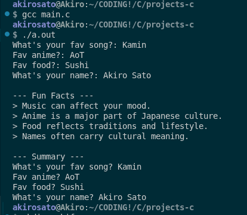

# 🚀 Askify-C


---

## 📌 Overview

Askify-C is a minimal command-line application written in C.  
It collects user responses through prompts, displays curated facts, and generates a structured summary.

Designed to demonstrate clean fundamentals of C programming with safe input handling.

---

## Demo



> **Note:** This demo may be outdated if not updated by the maintainer.

---

## ⚙️ Features

- Interactive CLI-based questions
- Safe input handling using `fgets`
- Newline trimming with `strcspn`
- Fact display system
- Summary generation
- Dynamic array sizing using `sizeof`

---

## 🧠 What It Demonstrates

- Structured function design
- Memory-safe practices (within bounds)
- Separation of concerns
- Basic user interaction in terminal apps

---

## 🛠️ Tech Stack

- Language: C  
- Libraries: `stdio.h`, `string.h`

---

## ▶️ How to Run

```bash
gcc main.c
./a.out
```

## 📄 License

This project is *licensed* under the **MIT License**.
You are **free** to *use, modify, and distribute it with attribution.*

## ✍️ Author

**Akiro Sato**